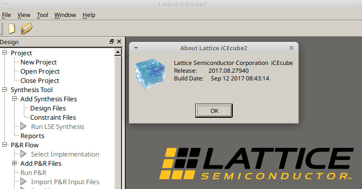

# Installing Lattice iCEcube2 FPGA tools on Ubuntu


Lattice iCEcube2 has not been updated for a while...

## Installing an old `libpng` package
```bash
wget http://security.ubuntu.com/ubuntu/pool/main/libp/libpng/libpng12-0_1.2.54-1ubuntu1.1_i386.deb
sudo dpkg -i libpng12-0_1.2.54-1ubuntu1.1_i386.deb
```

## Going through the interface issue
Lattice iCEcube2 license takes into account the MAC address of the computer. In order to work, the interface **must** be labeled as `eth0` as stated on [the TinyFPGA forum](https://discourse.tinyfpga.com/t/licence-problems/104/4) (don't ask me why...)
```bash
$ sudo ip link add eth0 type dummy
$ sudo ip link set eth0 address 10:65:30:ee:48:9a
```
Now, iCEcube2 should work!


## Shebang
You may need to modify the shebang of binary scripts installed in `$INSTALL_DIR/synpbase/bin` (for instance, `#!/bin/sh` to `#!/bin/bash`).
