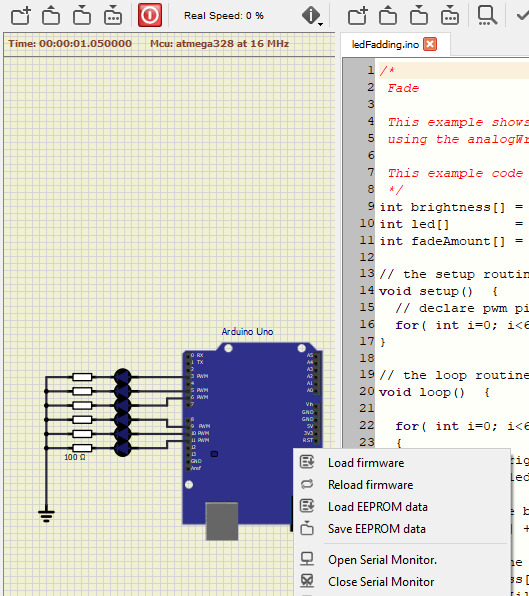

# Quick start guide for SimulIDE as an Arduino simulator

> The idea behind this tutorial is to show how to install SimulIDE to run codes for an Arduino Uno board. Screenshots below were taken from a Windows machine. It will be the same thing for Unix-based systems (tested on Ubuntu). Some comments for the Mac port at the end (but it works!)

## Downloading tools

- [SimulIDE](https://www.simulide.com/p/downloads.html) : Download the **Lin64 AppImage** or the **Win32.zip** archive depending of your operating system. 
- [Arduino](https://www.arduino.cc/en/Main/Software). Download the **Windows ZIP for non admin install** or the **Linux 64 bits** archive.

Extract softwares in a directory. You should get something similar to this:

## Example: blinking LEDs on an Arduino Uno

In order to execute SimulIDE, run the executable at: `<simulide_dir>/bin` (on Windows)

Here is the main interface :

### Schematic settings (red rectangle)

| 1 | 2 | 3 | 4 | 5 | 6 | 7 | 8 |
|---|---|---|---|---|---|---|---|
| SimulIDE settings | Switch between already opened files | New file | Open | Save | Save as | Run simulation | Pause |

### Code editor settings (blue rectangle)

| 1 | 2 | 3 | 4 | 5 | 6 | 7 | 8 |
|---|---|---|---|---|---|---|---|
| Code settings | Switch between already opened files | New file | Open | Save | Save as | Compile | Download on the Arduino |

Open the LED fadding example (`<simulide_dir>/share/simulide/examples/Arduino/ledFadding`)

- `.simu` file for the schematic.
- `.ino` file for the code.

### Compiler configuration

Right click on the `ledFadding.ino` and click `Compiler Settings`. Select the directory where you have the Arduino executable (`./simul_ide/arduino-1.8.12` in the screenshot below).

Now you should be able to compile and upload your code!

Now, just click on the red button in the upper left toolbar:

> Hint: if you need a serial monitor, right click on the Arduino and select **Open Serial Monitor**.

> Hint: if you need something like a real-time monitor, right click on the Arduino and select **Open MCU Monitor**. You'll be able to check register contents in real-time when the simulation is running !

## Alaternative compiler configuration

Sometimes, compiler settings are a bit painful. It amy be easier to compile the binary in the default Arduino IDE and export the HEX file to be loaded in the simulator.

- Compile the binary in the Arduino editor. Then click on `Sketch => Export compiled binary`.
- Then, right click on the Arduino and select `Load firmware` and look for the `*.hex` file just compiled close to the Arduino project file.
